<h1 align="center">Программа шифрования данных «VanishBox»</h1>
<h2 align="center">Краткое описание.</h2>

Программа предназначена для шифрования файлов с использованием гибридной системы шифрования. 
- RsaAesSha256, блочный шифр AES c длиной ключа 256 байт, ассиметричное шифрование RSA 4096, подпись файла HMACSHA256. 
- RsaGos, блочный шифр ГОСТ 34.12-2015, 34.13-2015, ассиметричный-RSA 4096, подпись файлов - ГОСТ 34.10-2012, 34.11-2012 

 

 Для хранения секретного ключа и закодированных файлов используется собственный формат.

Внешний вид главного окна программы:
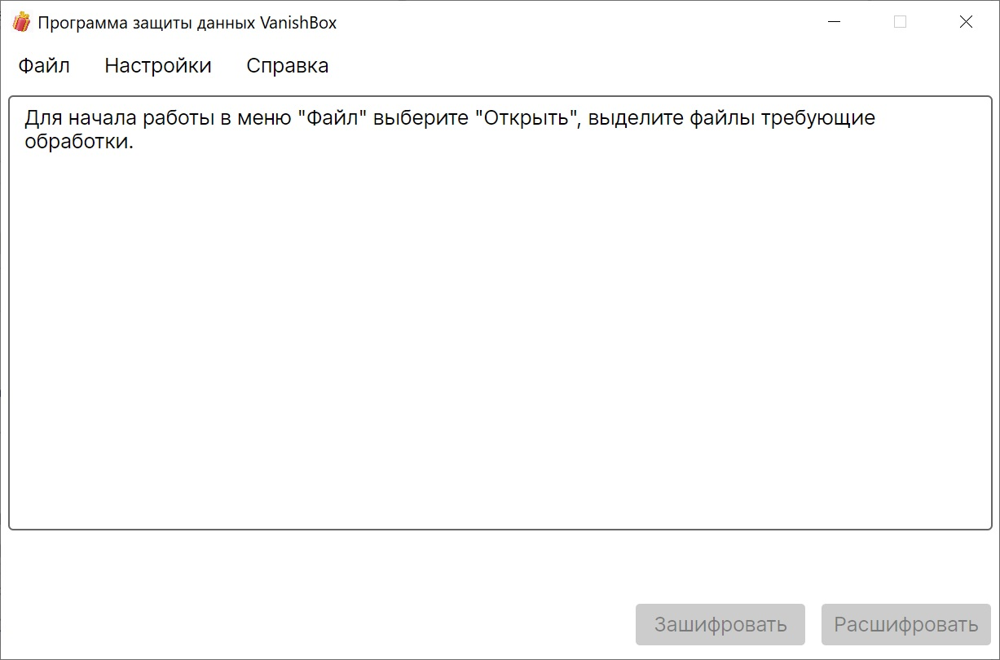

Для начала работы с программой необходимо сгенерировать закрытый(и открытый) ключ шифрования, который будет помещен в секретный ключевой контейнер.

В меню «Настройки» выберите пункт «Сгенерировать ключ»:
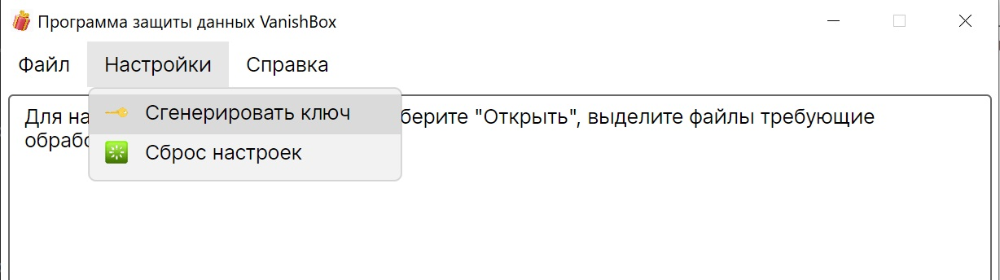

В появившемся окне выберите путь к папке в которую будет сохранен секретный ключ. Введите пароль для защиты контейнера секретного ключа. 
ВНИМАНИЕ! Утеря ключа или пароля приведет к невозможности расшифровки файлов. 
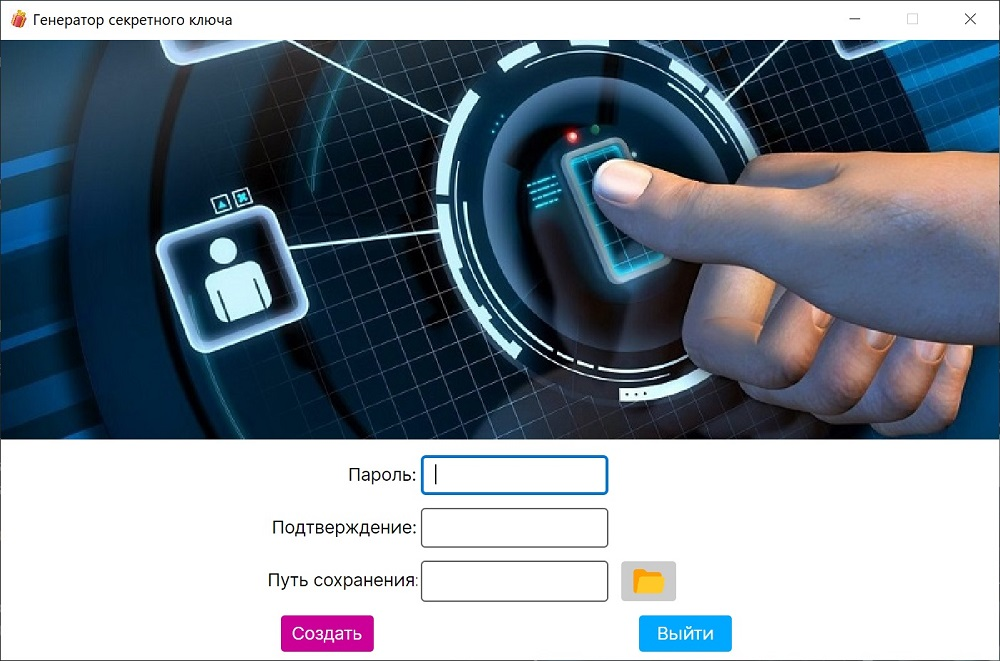

Дождитесь завершения операции. 
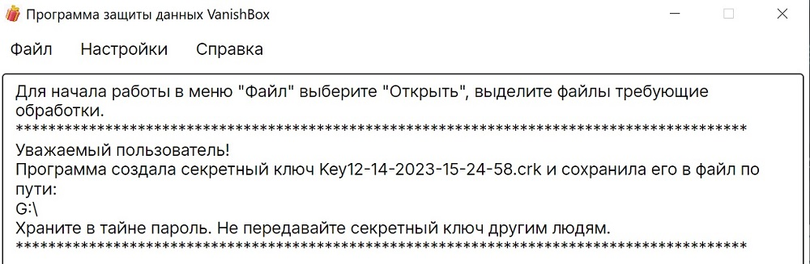

Шифруем файл:
 
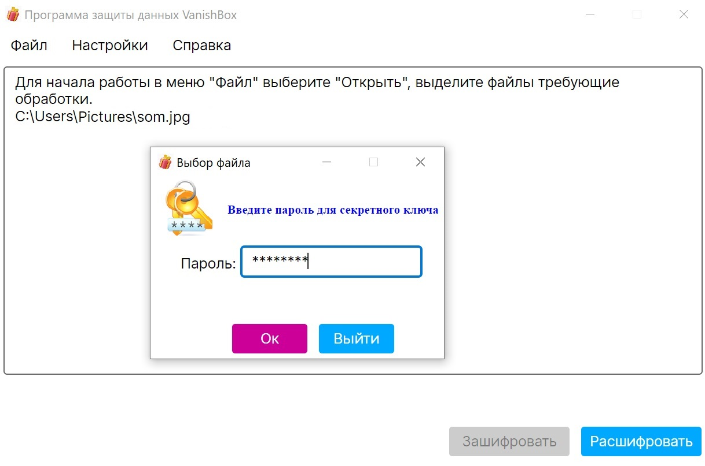 
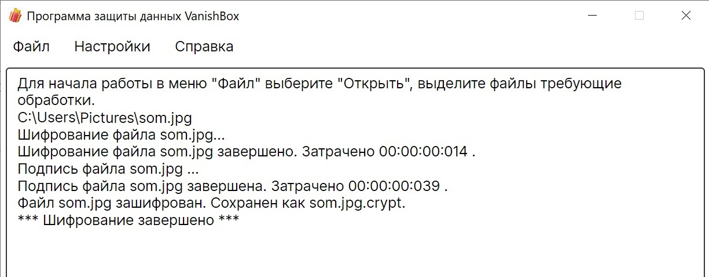

 

Зашифрованный файл:
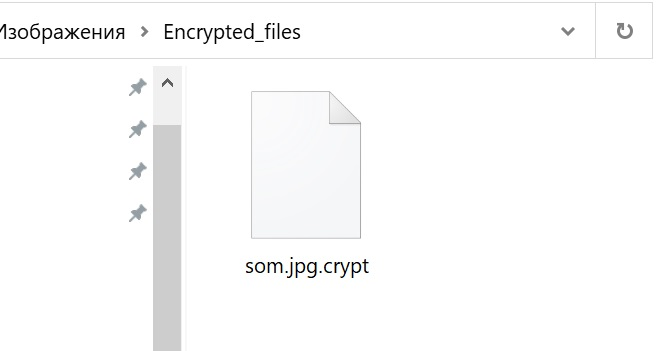

 

Расшифруем:
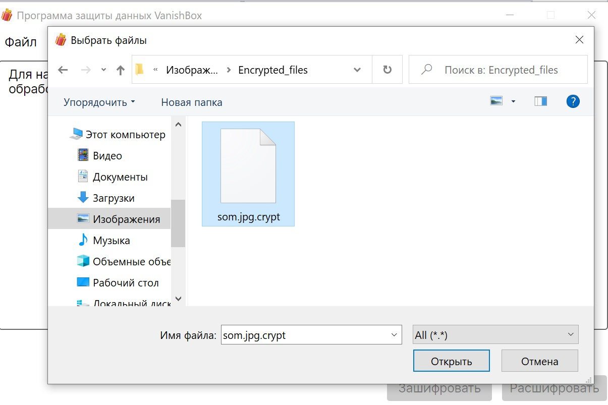 
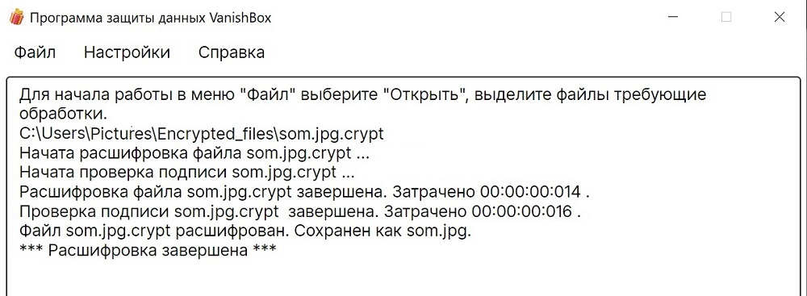 

 

Файл расшифрован 
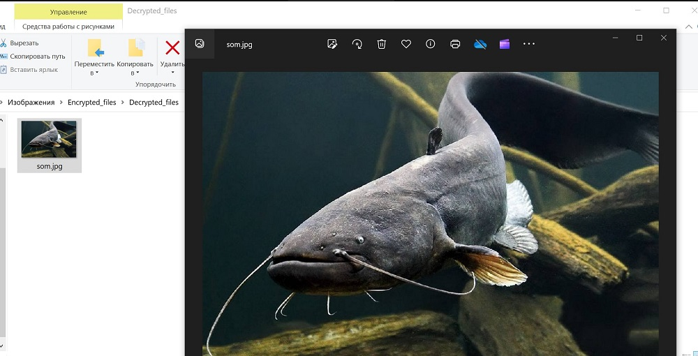  

<strong>
Cкорости декодирования(при использовании  hdd):
</strong> 
- RsaGos  2,3Мбайт/с (много поточность не реализована)  
- RsaAesSha256   90 Мбайт/с (20 поточный процессор с встроенным aes аппаратным блоком) 

Алгоритм, который будет использовать программа можно настроить в файле 
appsettings.json 
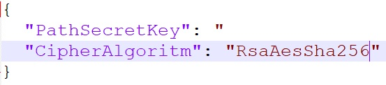 
Возможные варианты: 
 RsaGos, RsaAesSha256  
 

